# 🤖 AI Tester Blueprint

<div align="center">


**A comprehensive hands-on course for QA Engineers to master AI-powered testing tools and techniques.**

*Learn to build local AI tools, prompt engineering frameworks, automation accelerators, AI agents, and full-stack applications—all with a tester-first mindset.*

---

[🚀 Getting Started](#-getting-started) • [📚 Projects](#-projects) • [🛠️ Tech Stack](#️-tech-stack) • [🎯 Learning Path](#-learning-path)

</div>

---

## 📖 About This Course

The **AI Tester Blueprint** is a project-based course designed to transform QA engineers into AI-powered testing professionals. Across **8 hands-on projects**, you'll progress from local LLM basics to building production-grade AI agents. Each project introduces new concepts in:

- 🧠 **Local LLM Integration** — Running AI models on your machine using Ollama
- 🏗️ **Prompt Engineering** — Crafting effective prompts using RICE-POT & B.L.A.S.T. frameworks
- 🔄 **Code Conversion** — Migrating legacy test suites to modern frameworks
- 📝 **Test Case Generation** — AI-assisted test case creation from user stories and PRDs
- 🤖 **AI Agents** — Building autonomous AI agents that integrate with JIRA & LLMs
- 🚀 **Full-Stack Dev with AI** — Using AI coding assistants (Claude Code) to build real apps
- 📄 **Resume & Career Tools** — AI-powered resume optimization for QA professionals
- 🔗 **No-Code Automation** — Visual workflow automation with n8n

---

## 🚀 Getting Started

### Prerequisites

Before starting any project, ensure you have the following installed:

| Tool | Purpose | Installation |
|------|---------|--------------|
| **Ollama** | Local LLM Engine | [ollama.com](https://ollama.com/) |
| **Node.js** (v18+) | JavaScript Runtime | [nodejs.org](https://nodejs.org/) |
| **Python** (3.10+) | Backend Development | [python.org](https://python.org/) |
| **Java** (JDK 11+) | Selenium Projects | [adoptium.net](https://adoptium.net/) |
| **Maven** | Java Build Tool | [maven.apache.org](https://maven.apache.org/) |
| **n8n** *(Optional)* | No-Code Automation | [n8n.io](https://n8n.io/) |

### LLM Models Required

Pull the following models based on the project you're working on:

```bash
# For Project 1 - Test Case Generator
ollama pull llama3.2

# For Project 2 - Selenium to Playwright Converter
ollama pull codellama

# For Project 7 - TestPlan AI Agent (Local mode)
ollama pull llama3.2
```

---

## 📚 Projects

### 🔹 Project 1: Local Test Case Generator

> **AI-powered test case generation from User Stories using Llama 3.2**

| Aspect | Details |
|--------|---------|
| **Focus** | Test Case Generation, Prompt Engineering |
| **Tech Stack** | Python (FastAPI), Vanilla JS, Ollama |
| **LLM Model** | Llama 3.2 |
| **Key Concept** | B.L.A.S.T. Protocol for Agentic AI |

**What You'll Learn:**
- 🔒 Building privacy-first AI tools (no data leaves your machine)
- 📝 Structured output generation (JSON test cases)
- ⚡ Real-time UI with chat-like interface
- 🛠️ Deterministic tooling with Python

**Quick Start:**
```bash
cd Project1-LocalTestCaseGenerator
chmod +x start_system.sh
./start_system.sh
```

📂 **[View Project Details →](./Project1-LocalTestCaseGenerator/README.md)**

---

### 🔹 Project 2: Selenium to Playwright Converter

> **AI-powered migration tool: Convert Selenium Java to Playwright TypeScript**

| Aspect | Details |
|--------|---------|
| **Focus** | Code Conversion, Legacy Migration |
| **Tech Stack** | React (Vite), Node.js, TailwindCSS, Monaco Editor |
| **LLM Model** | CodeLlama |
| **Key Concept** | Modern UI with Glassmorphism Design |

**What You'll Learn:**
- 🔄 Automated code conversion patterns
- 🎨 Building beautiful developer tools
- 🔗 REST API design with Express proxy
- 📝 Monaco Editor integration for code input

**Quick Start:**
```bash
cd Project2-Selenium2PlaywrightLocalLLM
npm install
cd ui && npm install && cd ..
npm run dev
```

📂 **[View Project Details →](./Project2-Selenium2PlaywrightLocalLLM/README.md)**

---

### 🔹 Project 3: RICE-POT Prompt Framework (Selenium)

> **Enterprise-grade Selenium framework generated using the RICE-POT prompting technique**

| Aspect | Details |
|--------|---------|
| **Focus** | Prompt Engineering, Framework Generation |
| **Tech Stack** | Java, Selenium, Maven, TestNG |
| **Key Concept** | RICE-POT Prompt Framework |
| **Target App** | Salesforce Login Page |

**What You'll Learn:**
- 🏗️ Enterprise-level framework architecture
- 📋 Page Object Model with PageFactory
- 🎯 XPath-based locator strategies
- ⚙️ Robust exception handling patterns

**RICE-POT Framework:**

| Letter | Component | Purpose |
|:------:|-----------|---------|
| **R** | Role | Define AI persona |
| **I** | Instructions | Step-by-step commands & constraints |
| **C** | Context | Background information |
| **E** | Example | Code structure guidance |
| **P** | Parameters | Quality & accuracy constraints |
| **O** | Output | Exact artifacts to produce |
| **T** | Tone | Communication style |

**Quick Start:**
```bash
cd Project3-RICE_POT_PROMPT_SeleniumFrameowrk
mvn clean test
```

📂 **[View Project Details →](./Project3-RICE_POT_PROMPT_SeleniumFrameowrk/README.md)**

---

### 🔹 Project 4: Local LLM Prompt Templates

> **Production-ready prompt templates for test case generation from PRDs**

| Aspect | Details |
|--------|---------|
| **Focus** | Prompt Templates, PRD Analysis |
| **Tech Stack** | Playwright (TypeScript), Markdown Templates |
| **Key Concept** | Context-Constrained Prompting |
| **Target App** | VWO Platform |

**What You'll Learn:**
- 📄 Extracting test cases from Product Requirements Documents (PRDs)
- 🎯 Context and constraint file creation
- 📊 Test case categorization (Functional, Negative, Boundary, Edge)
- 🔐 Security and compliance testing patterns

**Includes:**
- `context_project.md` — Project context template
- `context_constraints.md` — Constraint definition template
- `Task1_TC_PRD.md` — PRD-to-test-case output example
- `Task2_BUG_Report.md` — Bug report template

📂 **[View Project Folder →](./Project4-LocalLLM_PROMOT_TEMPLATE/)**

---

### 🔹 Project 5: Job Board Assistant (AI-Built Full-Stack App)

> **A Kanban-style job application tracker — built entirely using Claude Code AI assistant**

| Aspect | Details |
|--------|---------|
| **Focus** | AI-Assisted Full-Stack Development |
| **Tech Stack** | React 19, TypeScript, Vite, Tailwind CSS 4 |
| **Key Concept** | Building production apps with AI coding assistants |
| **Storage** | Browser localStorage (no backend needed) |

**What You'll Learn:**
- 🤖 Using AI coding assistants (Claude Code) to generate complete applications
- 📊 Kanban board UI with drag-and-drop (6-column pipeline tracking)
- 📈 Dashboard statistics (response rate, conversion rate, weekly/monthly tracking)
- 💾 Local-first architecture with JSON export/import for data backup

**Key Features:**
- 6-stage pipeline: Wishlist → Applied → Interview → Offer → Rejected → Accepted
- Drag & drop cards between columns
- Search & filter by company, title, location, or status
- Track resumes used, cover letters, salary ranges, and application notes
- Export/import data as JSON backup

**Quick Start:**
```bash
cd Project5-ClaudeCodeJobAssitantBoard/job-board-assistant
npm install
npm run dev
```

📂 **[View Project Details →](./Project5-ClaudeCodeJobAssitantBoard/job-board-assistant/README.md)**

---

### 🔹 Project 6: AI Resume Fix for LinkedIn

> **AI-powered resume optimization tailored for QA/Testing professionals**

| Aspect | Details |
|--------|---------|
| **Focus** | Resume Optimization, Career Tools |
| **Tech Stack** | AI Prompts, DOCX/PDF Templates |
| **Key Concept** | AI-driven resume rewriting for QA roles |
| **Output** | Production-ready resume (DOCX + PDF) |

**What You'll Learn:**
- 📄 Using AI to rewrite and optimize resumes for specific QA/SDET roles
- 🎯 Tailoring resumes for LinkedIn and job applications
- ✍️ Effective AI prompting for professional document generation
- 📋 Resume formatting best practices for QA Managers and SDETs

📂 **[View Project Folder →](./Project6-ResumeFix_LinkedIn/)**

---

### 🔹 Project 7: TestPlan AI Agent + JIRA Integration

> **Full-stack AI agent that automates test plan creation from JIRA tickets using LLMs**

| Aspect | Details |
|--------|---------|
| **Focus** | AI Agents, JIRA Integration, Full-Stack Development |
| **Tech Stack** | Node.js (Express), React (Vite), TypeScript, Tailwind CSS, shadcn/ui |
| **LLM Providers** | Groq API (Cloud) + Ollama (Local) |
| **Key Concept** | B.L.A.S.T. Protocol + A.N.T. 3-Layer Architecture |
| **Integrations** | JIRA REST API v3, Groq SDK, Ollama, SQLite, PDF Parsing |

**What You'll Learn:**
- 🤖 Building autonomous AI agents with the **B.L.A.S.T. Protocol** (Blueprint, Link, Architect, Stylize, Trigger)
- 🏗️ **A.N.T. 3-Layer Architecture** (Architecture → Navigation → Tools)
- 🔗 JIRA API integration for fetching ticket data (summary, description, acceptance criteria)
- 🧠 Dual LLM support: Groq (cloud) for speed + Ollama (local) for privacy
- 📄 PDF template parsing for consistent test plan structure
- 🔐 Secure credential storage with OS keychain (`keytar`)
- 📊 Real-time streaming of LLM responses

**B.L.A.S.T. Protocol:**

| Phase | Name | Purpose |
|-------|------|---------|
| **B** | Blueprint | Vision & Logic — Discovery, Data Schema, Research |
| **L** | Link | Connectivity — API verification, credential testing |
| **A** | Architect | 3-Layer Build — SOPs, Navigation, Tools |
| **S** | Stylize | Refinement & UI — Payload formatting, UX polish |
| **T** | Trigger | Deployment & Execution |

**API Endpoints:**
```
POST /api/settings/jira        → Save JIRA credentials
POST /api/jira/fetch           → Fetch ticket by ID (e.g., "VWO-123")
POST /api/testplan/generate    → Generate test plan via LLM
POST /api/templates/upload     → Upload PDF template
GET  /api/settings/llm/models  → List available Ollama models
```

**Quick Start:**
```bash
cd Project7-TestPlan_AI_AGENT_JIRA/intelligent-test-plan-agent
# Backend
cd backend && npm install && npm run dev
# Frontend (in another terminal)
cd frontend && npm install && npm run dev
```

📂 **[View Project Details →](./Project7-TestPlan_AI_AGENT_JIRA/AGENTS.md)**

---

### 🔹 Project 8: n8n Workflow Automation (Coming Soon)

> **No-code/low-code test automation workflows using n8n**

| Aspect | Details |
|--------|---------|
| **Focus** | No-Code Automation, Visual Workflows |
| **Tech Stack** | n8n |
| **Key Concept** | Visual workflow automation for testers |
| **Status** | 🚧 Coming Soon |

**What You'll Learn:**
- 🔗 Building visual automation workflows without code
- 🔄 Integrating testing tools via n8n nodes
- ⚡ Automating repetitive QA tasks with visual pipelines
- 🛠️ Connecting APIs, databases, and notification systems

📂 **[View Project Folder →](./Project8-n8n_Learning/)**

---

## 🛠️ Tech Stack

<div align="center">

| Category | Technologies |
|----------|-------------|
| **AI/LLM** | Ollama, Llama 3.2, CodeLlama, Groq API |
| **Backend** | Python (FastAPI), Node.js (Express), TypeScript |
| **Frontend** | React 18/19, Vite, Vanilla JS, TailwindCSS, shadcn/ui |
| **Automation** | Selenium, Playwright, TestNG |
| **Integrations** | JIRA REST API v3, Groq SDK, Ollama SDK |
| **Storage** | SQLite, localStorage, OS Keychain (keytar) |
| **Languages** | Python, JavaScript/TypeScript, Java |
| **Build Tools** | Maven, npm, Vite |
| **AI Assistants** | Claude Code, Ollama |
| **No-Code** | n8n |

</div>

---

## 🎯 Learning Path

```mermaid
graph LR
    A[🚀 Start] --> B[Project 1]
    B --> C[Project 2]
    C --> D[Project 3]
    D --> E[Project 4]
    E --> F[Project 5]
    F --> G[Project 6]
    G --> H[Project 7]
    H --> I[Project 8]
    I --> J[🎓 AI Tester Ready!]
    
    B["Project 1<br>Test Case Generator"]
    C["Project 2<br>Code Converter"]
    D["Project 3<br>Prompt Framework"]
    E["Project 4<br>PRD Templates"]
    F["Project 5<br>AI-Built App"]
    G["Project 6<br>Resume Fix"]
    H["Project 7<br>AI Agent + JIRA"]
    I["Project 8<br>n8n Workflows"]
```



### Recommended Order:

1. **Project 1** — Learn the basics of local LLM integration and test case generation
2. **Project 2** — Apply LLM skills to code conversion with a beautiful UI
3. **Project 3** — Master the RICE-POT prompt framework for enterprise code generation
4. **Project 4** — Create reusable prompt templates for real-world PRD analysis
5. **Project 5** — Build a full-stack application using AI coding assistants
6. **Project 6** — Use AI to optimize resumes and career documents
7. **Project 7** — Build an autonomous AI agent integrated with JIRA (capstone-level)
8. **Project 8** — Explore no-code automation with n8n visual workflows

---

## 📁 Repository Structure

```
AITesterBlueprint/
├── Project1-LocalTestCaseGenerator/              # 🧪 AI Test Case Generator
│   ├── backend/                                  #    FastAPI Backend
│   ├── frontend/                                 #    Vanilla JS UI
│   ├── tools/                                    #    Python Tools
│   ├── architecture/                             #    System Architecture
│   └── BLAST.md                                  #    B.L.A.S.T. Protocol
│
├── Project2-Selenium2PlaywrightLocalLLM/          # 🔄 Code Converter
│   ├── ui/                                       #    React Frontend
│   ├── tools/                                    #    Utility Scripts
│   ├── server.js                                 #    Express Proxy
│   └── B.L.A.S.T.md                              #    B.L.A.S.T. Protocol
│
├── Project3-RICE_POT_PROMPT_SeleniumFrameowrk/    # 🏗️ Selenium Framework
│   ├── src/main/java/                            #    Page Objects
│   ├── src/test/java/                            #    Test Scripts
│   ├── pom.xml                                   #    Maven Config
│   └── testng.xml                                #    TestNG Suite
│
├── Project4-LocalLLM_PROMOT_TEMPLATE/             # 📝 Prompt Templates
│   ├── src/                                      #    Playwright Tests
│   ├── context_project.md                        #    Project Context Template
│   ├── context_constraints.md                    #    Constraints Template
│   └── Task1_TC_PRD.md                           #    Test Case Output
│
├── Project5-ClaudeCodeJobAssitantBoard/           # 💼 Job Board Assistant
│   └── job-board-assistant/                      #    React + TypeScript App
│       ├── src/                                  #    Components & Logic
│       └── dist/                                 #    Production Build
│
├── Project6-ResumeFix_LinkedIn/                   # 📄 Resume Optimizer
│   └── Resume_FIX/                               #    Resume Templates (DOCX/PDF)
│
├── Project7-TestPlan_AI_AGENT_JIRA/               # 🤖 AI Agent + JIRA
│   ├── intelligent-test-plan-agent/              #    Full-Stack Application
│   │   ├── backend/                              #    Express + TypeScript API
│   │   └── frontend/                             #    React + Vite + shadcn/ui
│   ├── prompt/                                   #    Project Prompt Spec
│   ├── templates/                                #    Test Plan Templates
│   ├── BLAST.md                                  #    B.L.A.S.T. Protocol
│   ├── AGENTS.md                                 #    Agent Architecture Docs
│   ├── gemini.md                                 #    Project Constitution
│   ├── task_plan.md                              #    Phase Planning
│   ├── findings.md                               #    Research & Discoveries
│   └── progress.md                               #    Progress Tracking
│
├── Project8-n8n_Learning/                         # 🔗 n8n Workflows (Coming Soon)
│
└── README.md                                      # 📖 This File
```

---

## 🧩 Key Frameworks & Protocols

This course introduces two original prompt engineering frameworks:

### 🚀 B.L.A.S.T. Protocol
*Used in Projects 1, 2, and 7*

A 5-phase protocol for building deterministic, self-healing automation:
- **B**lueprint — Vision, logic, and discovery
- **L**ink — API connectivity verification
- **A**rchitect — 3-layer build (Architecture → Navigation → Tools)
- **S**tylize — UI/UX refinement
- **T**rigger — Deployment and execution

### 🍚 RICE-POT Framework
*Used in Project 3*

A 7-component prompting technique for generating enterprise-grade code:
- **R**ole → **I**nstructions → **C**ontext → **E**xample → **P**arameters → **O**utput → **T**one

---

## 🤝 Contributing

We welcome contributions! To add a new project:

1. Create a new folder: `ProjectN-YourProjectName/`
2. Include a comprehensive `README.md`
3. Add a `BLAST.md` if following the B.L.A.S.T. protocol
4. Follow the established folder structure patterns
5. Update this main README with your project details

---

## 📜 License

This course material is part of the **AI Tester Blueprint** series.

---

## 👨‍💻 Author

**Pramod Dutta**  
*QA Automation Expert | AI Testing Advocate*

[](https://github.com/PramodDutta)

---

<div align="center">

**Built with ❤️ for the QA Community**

*Empowering testers to harness the power of AI — from local LLMs to autonomous agents*

</div>
